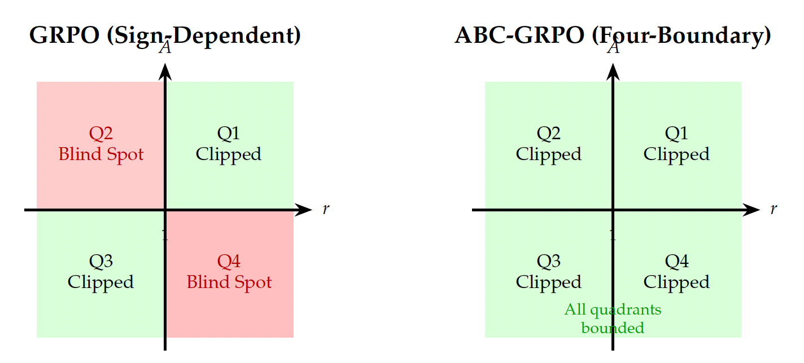
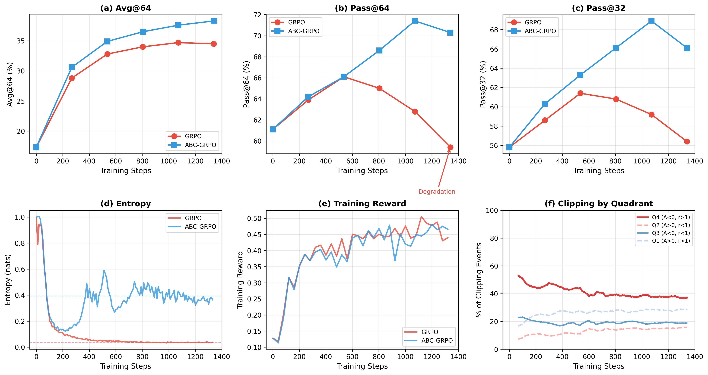

<div align="center">

<h1>ABC-GRPO: Adaptive-Boundary-Clipping GRPO</h1>

<p align="center"><em>Ensuring Bounded Ratios for Stable and Generalizable Training</em></p>

[](https://arxiv.org/abs/2601.03895)
[](https://github.com/chi2liu/trl/tree/abc-grpo)
[](2601.03895v1.pdf)

</div>

---

## 📣 Latest News

**[January 7, 2026]** 🔍 We propose **ABC-GRPO**, introducing 4 independent clipping boundaries instead of GRPO's 2 conditional boundaries, providing unconditional bounds across all four quadrants of the (r, Â) space. 📄 [Paper available on arXiv](https://arxiv.org/abs/2601.03895).

---

## 📌 Overview

Group Relative Policy Optimization (GRPO) has emerged as a popular algorithm for reinforcement learning with large language models (LLMs). However, upon analyzing its clipping mechanism, we argue that it is suboptimal in certain scenarios. With appropriate modifications, GRPO can be significantly enhanced to improve both flexibility and generalization. To this end, we propose **Adaptive-Boundary-Clipping GRPO (ABC-GRPO)**, an asymmetric and adaptive refinement of the original GRPO framework. We demonstrate that ABC-GRPO achieves superior performance over standard GRPO on mathematical reasoning tasks using the Qwen3 LLMs. Moreover, ABC-GRPO maintains substantially higher entropy throughout training, thereby preserving the model's exploration capacity and mitigating premature convergence.

### 💡 Key Innovation

ABC-GRPO introduces **4 independent clipping boundaries** (ε₁, ε₂, ε₃, ε₄) instead of GRPO's 2 conditional boundaries:

- **GRPO**: Uses conditional clipping that depends on advantage sign, leaving Q2 and Q4 unbounded
- **ABC-GRPO**: Applies unconditional clipping with four independent parameters, ensuring bounded gradient updates in all quadrants

This design prevents unbounded gradient updates, particularly addressing the critical issue where tokens with negative advantages and high likelihood ratios (Q4) receive excessive suppression, leading to entropy collapse and degraded generalization.

<div align="center">

<p><em>Four-quadrant analysis: GRPO has blind spots in Q2 and Q4, while ABC-GRPO provides unconditional bounds across all quadrants.</em></p>
</div>

---

## 🔍 Key Features

- **4-Boundary Clipping**: Independent epsilon values (ε₁, ε₂, ε₃, ε₄) for all four (r, Â) quadrants
- **Unconditional Bounds**: Prevents unbounded gradient updates regardless of advantage sign
- **Entropy Preservation**: Maintains substantially higher entropy (10.9× higher than GRPO) throughout training
- **Improved Generalization**: Achieves monotonic improvement in Pass@64 while GRPO degrades
- **Q4 Protection**: Addresses the critical blind spot where 41.4% of clipping events occur

---

## 📊 Benchmark Results

### Qwen3-1.7B-Base

| Method | Dataset | Avg@64 | Pass@2 | Pass@4 | Pass@8 | Pass@16 | Pass@32 | Pass@64 |
|--------|---------|--------|--------|--------|--------|---------|---------|---------|
| **Base** | AIME24 | 3.4 | 6.7 | 10.0 | 13.3 | 13.3 | 16.7 | 30.0 |
| GRPO | AIME24 | 8.4 | 16.7 | 20.0 | 26.7 | 26.7 | 30.0 | 30.0 |
| **ABC-GRPO** | AIME24 | **9.8** | 10.0 | 20.0 | 26.7 | **36.7** | **36.7** | **36.7** |
| *Gain* | | *+16.7%* | *-40.1%* | *-* | *-* | *+37.5%* | *+22.3%* | *+22.3%* |
| | | | | | | | | |
| **Base** | AIME25 | 3.2 | 10.0 | 13.3 | 16.7 | 26.7 | 30.0 | 40.0 |
| GRPO | AIME25 | 5.6 | 6.7 | 6.7 | 10.0 | 16.7 | 20.0 | 26.7 |
| **ABC-GRPO** | AIME25 | **8.0** | **10.0** | **13.3** | **16.7** | **23.3** | **33.3** | **36.7** |
| *Gain* | | *+42.9%* | *+49.3%* | *+98.5%* | *+67.0%* | *+39.5%* | *+66.5%* | *+37.5%* |
| | | | | | | | | |
| **Base** | AMC23 | 24.5 | 40.0 | 57.5 | 65.0 | 75.0 | 82.5 | 90.0 |
| GRPO | AMC23 | 38.5 | 45.0 | 52.5 | 67.5 | 82.5 | 90.0 | 92.5 |
| **ABC-GRPO** | AMC23 | **44.2** | **60.0** | **65.0** | **75.0** | 80.0 | 87.5 | 92.5 |
| *Gain* | | *+14.8%* | *+33.3%* | *+23.8%* | *+11.1%* | *-3.0%* | *-2.8%* | *-* |

### Qwen3-4B-Base

| Method | Dataset | Avg@64 | Pass@2 | Pass@4 | Pass@8 | Pass@16 | Pass@32 | Pass@64 |
|--------|---------|--------|--------|--------|--------|---------|---------|---------|
| **Base** | AIME24 | 8.1 | 16.7 | 23.3 | 23.3 | 36.7 | 40.0 | 50.0 |
| GRPO | AIME24 | 20.3 | 23.3 | 23.3 | 33.3 | 33.3 | 36.7 | 43.3 |
| **ABC-GRPO** | AIME24 | **25.9** | **30.0** | **30.0** | **36.7** | **50.0** | **56.7** | **66.7** |
| *Gain* | | *+27.6%* | *+28.8%* | *+28.8%* | *+10.2%* | *+50.2%* | *+54.5%* | *+54.0%* |
| | | | | | | | | |
| **Base** | AIME25 | 5.9 | 10.0 | 23.3 | 30.0 | 33.3 | 40.0 | 43.3 |
| GRPO | AIME25 | 20.0 | 20.0 | 23.3 | 30.0 | 33.3 | 40.0 | 40.0 |
| **ABC-GRPO** | AIME25 | **20.6** | **26.7** | **33.3** | **36.7** | **40.0** | **46.7** | **46.7** |
| *Gain* | | *+3.0%* | *+33.5%* | *+42.9%* | *+22.3%* | *+20.1%* | *+16.8%* | *+16.8%* |
| | | | | | | | | |
| **Base** | AMC23 | 37.9 | 62.5 | 80.0 | 82.5 | 85.0 | 87.5 | 90.0 |
| GRPO | AMC23 | 63.1 | 67.5 | 75.0 | 80.0 | 87.5 | 92.5 | 95.0 |
| **ABC-GRPO** | AMC23 | **68.4** | **82.5** | **90.0** | **92.5** | **95.0** | **95.0** | **97.5** |
| *Gain* | | *+8.4%* | *+22.2%* | *+20.0%* | *+15.6%* | *+8.6%* | *+2.7%* | *+2.6%* |

### Summary

> ABC-GRPO achieves **+18.3% Avg@64** improvement for 1.7B and **+11.0%** for 4B on average across all benchmarks compared to GRPO. Critically, ABC-GRPO maintains **monotonic improvement** in Pass@64 while standard GRPO degrades, directly addressing the reasoning boundary limitation of current RLVR methods.

---

## 🧠 Why ABC-GRPO?

### Problems with Standard GRPO

- ❌ **Q4 Unbounded Issue**: When  < 0 and r > 1, GRPO has no upper bound on r, leading to unbounded punishment
- ❌ **Entropy Collapse**: Excessive suppression of correct tokens in failed sequences reduces output diversity
- ❌ **Pass@k Degradation**: While Pass@1 improves, Pass@64 decreases during training
- ❌ **Blind Spots**: Q2 and Q4 quadrants together comprise 48.7% of clipping events but are unprotected

### ABC-GRPO Solutions

- ✅ **4-Boundary Clipping**: Independent control over all four quadrants
- ✅ **Bounded Updates**: Both upper and lower bounds in all quadrants
- ✅ **Higher Entropy**: Maintains 10.9× higher entropy than GRPO
- ✅ **Better Generalization**: Monotonic improvement in Pass@k metrics

### Training Dynamics Comparison

<div align="center">

<p><em>Training dynamics comparison showing ABC-GRPO's advantages: (a) Superior Avg@64 performance, (b-c) Monotonic Pass@k improvement vs GRPO degradation, (d) 10.9× higher entropy preservation, (e) Similar training rewards, (f) Q4 accounts for 41.4% of clipping events.</em></p>
</div>

---

## 🔧 Installation

### Prerequisites

ABC-GRPO is implemented as a branch of TRL (Transformer Reinforcement Learning) library based on version 0.25.1. The core ABC-GRPO algorithm implementation can be found in the [abc-grpo branch](https://github.com/chi2liu/trl/tree/abc-grpo) of the TRL repository.

### Environment Setup for ABC-GRPO

We recommend using [uv](https://github.com/astral-sh/uv) for fast and reliable dependency management:

```bash
# Clone the ABC-GRPO codebase
git clone https://github.com/chi2liu/ABC-GRPO.git
cd ABC-GRPO

# Create virtual environment with Python 3.11
uv venv abc-grpo --python 3.11

# Activate the environment
source abc-grpo/bin/activate

# Install dependencies (includes ABC-GRPO TRL branch)
uv pip install -r requirements-abc-grpo.txt
uv pip install flash-attn --no-build-isolation
```

### Environment Setup for GRPO Baseline

To reproduce the standard GRPO baseline results:

```bash
# Create virtual environment with Python 3.11
uv venv grpo --python 3.11

# Activate the environment
source grpo/bin/activate

# Install dependencies (includes standard TRL 0.25.1)
uv pip install -r requirements-grpo.txt
uv pip install flash-attn --no-build-isolation
```

### Additional Setup

```bash
# Login to Hugging Face
huggingface-cli login

# (Optional) Login to Weights & Biases for experiment tracking
wandb login
```

---

## 🚀 Usage

### Training Scripts

Pre-configured training scripts are available in the `sh/` directory. Simply activate the corresponding environment and run the script:

**ABC-GRPO Training:**
```bash
# Activate ABC-GRPO environment
source abc-grpo/bin/activate

# Train Qwen3-1.7B with ABC-GRPO
bash sh/train_qwen_1.7b_base_abc_grpo.sh

# Train Qwen3-4B with ABC-GRPO
bash sh/train_qwen_4b_base_abc_grpo.sh
```

**GRPO Baseline Training:**
```bash
# Activate GRPO environment
source grpo/bin/activate

# Train Qwen3-1.7B with GRPO baseline
bash sh/train_qwen_1.7b_base_grpo.sh

# Train Qwen3-4B with GRPO baseline
bash sh/train_qwen_4b_base_grpo.sh
```

All training configurations are stored in the `recipes/` directory. The key difference between ABC-GRPO and GRPO is the 4-boundary clipping parameters in the configuration files.

---

## 📊 Evaluation

### Environment Setup for Evaluation

Create a separate environment for running evaluations:

```bash
# Create virtual environment with Python 3.11
uv venv eval --python 3.11

# Activate the environment
source eval/bin/activate

# Install evaluation dependencies
uv pip install -r requirements-eval.txt
```

### Automatic Checkpoint Evaluation

Use the provided script to automatically evaluate all checkpoints with Avg@k metrics:

```bash
# Navigate to eval_math directory
cd eval_math

# Run evaluation for all checkpoints
# Usage: bash sh/eval_auto_checkpoints_avgk.sh <model_dir> <output_dir> <context_length> <gpu_devices>
bash sh/eval_auto_checkpoints_avgk.sh \
    /mnt/models/Qwen3-1.7B-Base-grpo \
    ./evals/Qwen3-1.7B-Base-grpo \
    16384 \
    0,1,2,3,4,5,6,7
```

**Parameters:**
- `model_dir`: Directory containing checkpoint-* subdirectories
- `output_dir`: Directory to save evaluation results
- `context_length`: Maximum context length (e.g., 4096, 16384, 32768)
- `gpu_devices`: Comma-separated GPU IDs to use

The script will:
1. Automatically discover all checkpoints in the model directory
2. Evaluate each checkpoint on AIME 2024, AIME 2025, and AMC 2023
3. Generate Avg@32 and Pass@k metrics (k ∈ {2,4,8,16,32,64})
4. Save results and generate a summary report

### Evaluation Benchmarks

- **AIME 2024/2025**: American Invitational Mathematics Examination (30 problems each)
- **AMC 2023**: American Mathematics Competition (40 problems)
- **HMMT 2025**: Harvard-MIT Mathematics Tournament (additional benchmark)

### Evaluation Metrics

- **Avg@k**: Average Pass@1 accuracy over k samplings
- **Pass@k**: Success rate with at least one correct answer in k attempts (k ∈ {2,4,8,16,32,64})
- **Greedy Accuracy**: Pass@1 with temperature=0

The Avg@32 and Avg@64 metrics are particularly important for measuring the model's reasoning consistency across multiple attempts.

---

## 📚 Repository Structure

```
ABC-GRPO/
├── src/
│   ├── abcgrpo/           # ABC-GRPO training scripts
│   │   ├── configs.py             # Configuration classes
│   │   └── grpo.py                # ABC-GRPO training script
│   └── open_r1/           # Standard GRPO baseline
│       ├── rewards.py             # Reward functions
│       ├── grpo.py               # Standard GRPO script
│       └── utils/                # Training utilities
├── recipes/               # Training configurations
│   ├── accelerate_configs/        # DeepSpeed, FSDP configs
│   ├── Qwen3-1.7B-Base/grpo/     # 1.7B model configs
│   └── Qwen3-4B-Base/grpo/       # 4B model configs
├── sh/                    # Training scripts
└── CLAUDE.md             # Developer documentation
```

---

## 🤝 Citation

If you find ABC-GRPO helpful, please cite our paper:

```bibtex
@misc{liu2026adaptiveboundaryclippinggrpoensuringbounded,
      title={Adaptive-Boundary-Clipping GRPO: Ensuring Bounded Ratios for Stable and Generalizable Training},
      author={Chi Liu and Xin Chen},
      year={2026},
      eprint={2601.03895},
      archivePrefix={arXiv},
      primaryClass={cs.LG},
      url={https://arxiv.org/abs/2601.03895},
}
```

---

## 📬 Contact

For questions, feedback, or collaboration:
- Chi Liu: chiliu@whu.edu.cn
- Issues: [GitHub Issues](https://github.com/chi2liu/ABC-GRPO/issues)

---

## 🙏 Acknowledgments

ABC-GRPO is built on top of:
- [TRL](https://github.com/huggingface/trl) - Transformer Reinforcement Learning library
- [Open R1](https://github.com/huggingface/open-r1) - Open-source reasoning model framework
- [GHPO](https://github.com/hkgc-1/GHPO) - Reference implementation for code structure and design patterns
- [Qwen Team](https://github.com/QwenLM) - For the excellent Qwen3 base models

---

## 📄 License

This project is licensed under the Apache License 2.0 - see the [LICENSE](LICENSE) file for details.
